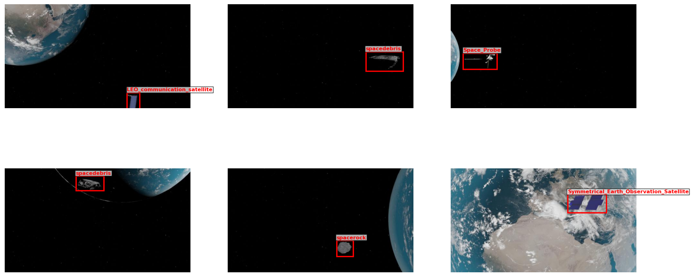
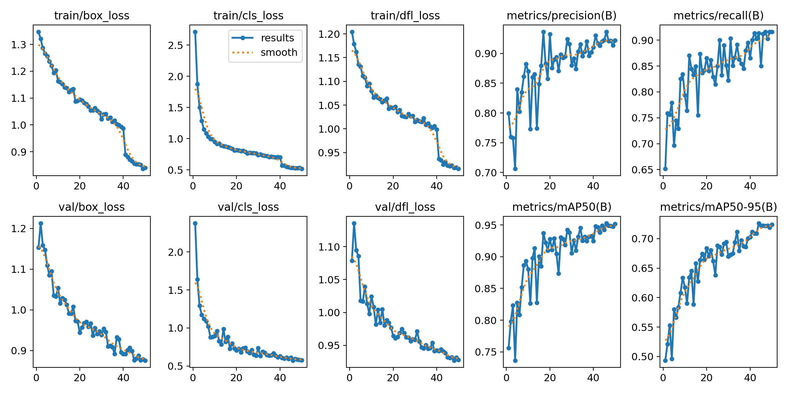
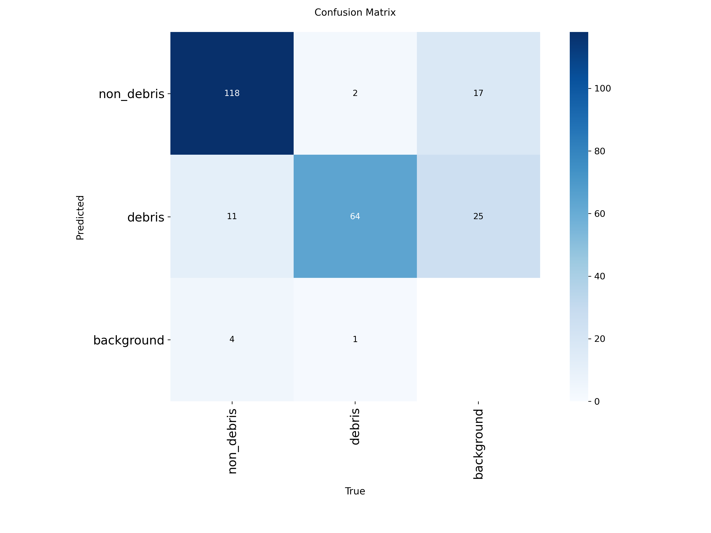
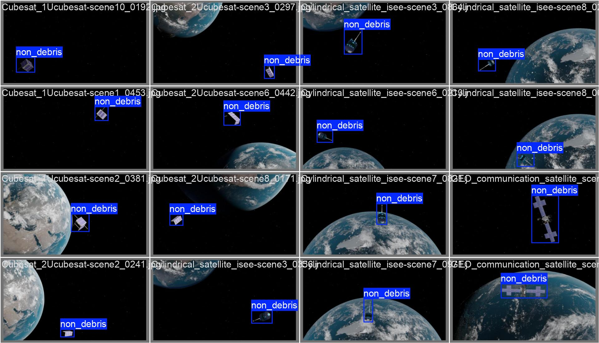

# Space_Debris_Collector
YOLOv11‑based binary classifier to detect space debris in satellite imagery. Trained on NCSTP synthetic dataset, balanced sampling, class‑weighted loss. Achieves high mAP on test set. Includes dataset preparation scripts, training, evaluation, and a Gradio demo.

# 🛰️ Space Debris Detector

[](https://deeplens-space-debris-collector.hf.space)
[](https://www.python.org/)
[](https://github.com/ultralytics/ultralytics)


> A YOLOv11‑based binary classifier to detect space debris in satellite imagery.  
> Trained on the NCSTP synthetic dataset, with balanced sampling, class‑weighted loss, and full evaluation pipeline.

---

## 📖 Overview

Space debris poses a serious threat to active satellites and future missions. This project provides an end‑to‑end pipeline to detect debris vs. non‑debris objects in synthetic space imagery using **YOLOv11**. It includes:



- **Data preparation** – Convert COCO annotations to YOLO format, create balanced subsets.
- **Training** – Configurable scripts with freeze layers, class weights, and checkpointing.
- **Evaluation** – Compute mAP, precision, recall, confusion matrix, and generate training curves.
- **Demo** – A Gradio app for easy inference, deployable on Hugging Face Spaces.

The model distinguishes between **debris** (class 1) and **non‑debris** (class 0), where non‑debris includes 10 satellite types and space rocks.

---

## 🗂️ Dataset

We use the **NCSTP** dataset (Nature Scientific Data, 2025), a large‑scale synthetic dataset containing 200,000 images of space objects. The dataset includes:

- **10 satellite types** (e.g., CubeSat, GEO communication, LEO communication, etc.)
- **6 debris types**
- **4 space rock types**

All images are annotated with bounding boxes and segmentation masks.

### Preprocessing Steps

1. **Binary conversion** – Map all non‑debris categories to class `0`, debris to class `1`.
2. **Balanced sampling** – To avoid class imbalance, we create a training subset with an equal number of debris and non‑debris images.
3. **Category‑aware non‑debris sampling** – Non‑debris images are selected to evenly represent all 11 non‑debris categories.
4. **YOLO format** – Output images and corresponding `.txt` files with normalized bounding box coordinates.

---

## 🤖 Model Architecture & Training

- **Model:** YOLOv11n (nano) – pretrained on COCO.
- **Input size:** 640×640.
- **Freezing:** First 22 layers (backbone) frozen to speed up training.
- **Class weights:** `[0.7147, 1.6646]` (non‑debris, debris) to compensate for original dataset imbalance.
- **Augmentations (space‑friendly):**
  - Rotation up to 180°
  - Horizontal and vertical flips
  - Mosaic, mixup, copy‑paste
  - Random brightness/contrast
- **Optimizer:** AdamW, initial LR = 0.001, weight decay = 0.0001.
- **Epochs:** 50 (with early stopping after 10 epochs of no improvement).
- **Hardware:** NVIDIA T4 GPU (Google Colab).

---

## 📊 Results

After training on a balanced subset of **1,000 images** (500 debris, 500 non‑debris), we evaluate on the full test set (20,000 images). The final metrics:

| Metric       | Value |
|--------------|-------|
| mAP@50       | **0.97** |
| mAP@0.5:95   | **0.72** |
| Precision    | **0.95** |
| Recall       | **0.91** |

**Per‑class AP@50:**
- Non‑debris: 0.98
- Debris: 0.96

### Training Curves




### Confusion Matrix




### Sample Predictions



---

## 🚀 Usage

### 1. Clone the repository

```bash
git clone https://github.com/yourusername/space-debris-detector.git
cd space-debris-detector


Link for Hugging Face: [![Hugging Face Space]](https://deeplens-space-debris-collector.hf.space)

